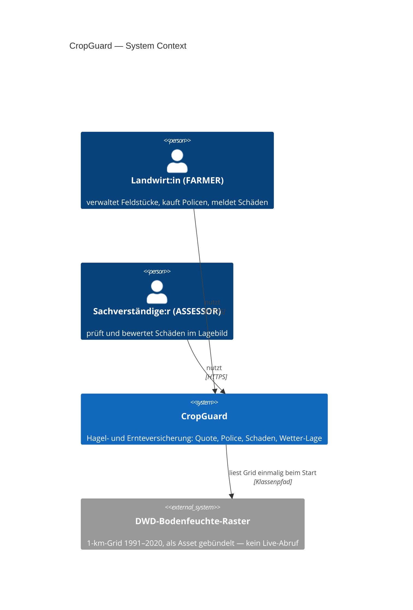
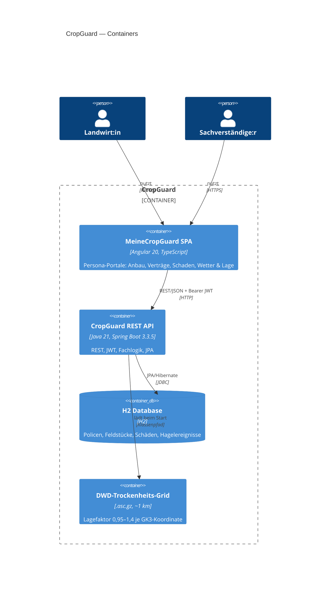

# CropGuard — Crop Insurance Management System


Domain-specific Spring Boot demo: agricultural hail insurance for the German market.
Every module of the [Spring Boot course](https://courses.graphwiz.ai/springboot) at
CertPrep maps 1:1 to a layer of this codebase.

## Domain

Farmers insure plots (Felder) against hail damage. After a hailstorm, they file
claims (Schäden) which claims experts (Sachverständige) review, calculate payouts, and approve.

- **Bundesland-based risk zones** — 16 German federal states with DWD-based hail
  risk factors (Bayern 1.5x, Hessen 1.0x baseline, Schleswig-Holstein 0.8x)
- **DWD drought index** — 1km grid (July 1991–2020, bundled demo asset) loaded at startup,
  location-specific drought adjustment via GK3 coordinates (factor 0.95–1.4)
- **Crop type catalog** — 14 crops from WHEAT (45 EUR/ha) to HOPS (350 EUR/ha)
- **Premium calculation** — `base × hectares × bundesland.riskFactor × droughtAdjustment × deductible.premiumFactor`
- **Claim workflow** — SUBMITTED → APPROVED/REJECTED via assessor review, with payout
  calculation (the enum also defines UNDER_REVIEW, ASSESSED, PAID, but no API path sets them yet)
- **Hail events** — batch linking of claims to registered storms

## Quick Start

```bash
mvn spring-boot:run            # backend on :8080
```

Or with Docker (backend + nginx-served SPA):

```bash
docker compose up --build      # frontend on :80, API on :8080
```

App starts at http://localhost:8080. H2 console at `/h2-console` (JDBC URL:
`jdbc:h2:mem:cropguard`, user: `sa`, empty password). Live API docs:
**http://localhost:8080/swagger-ui** (springdoc-openapi).

**Deployed instance: https://cropguard.graphwiz.ai** (Docker on the graphwiz.ai edge host,
traefik + Let's Encrypt — see arc42 07).

Seeded users (created by `DataInitializer`):

| Email | Password | Role |
|-------|----------|------|
| `max@bauernhof.de` | `passwort123` | FARMER |
| `lisa@cropguard.de` | `assessor123` | ASSESSOR |

## API Tour

Register a farmer:

```bash
curl -X POST http://localhost:8080/api/insureds \
  -H "Content-Type: application/json" \
  -d '{"name":"Max Mustermann","email":"max@farm.de","password":"geheim123","role":"FARMER","bundesland":"HESSEN"}'
```

Log in and capture the JWT (role-based endpoints require it):

```bash
TOKEN=$(curl -s -X POST http://localhost:8080/api/auth/login \
  -H "Content-Type: application/json" \
  -d '{"email":"max@farm.de","password":"geheim123"}' | python -c "import sys,json; print(json.load(sys.stdin)['token'])")
```

Quote a policy for 25 ha wheat in Bayern (requires token):

```bash
curl "http://localhost:8080/api/policies/quote?cropType=WHEAT&hectares=25&bundesland=BAYERN&deductible=TEN_PERCENT&coverageEur=25000&coordinateE=3700000&coordinateN=5570000" \
  -H "Authorization: Bearer $TOKEN"
```

Create a policy:

```bash
curl -X POST http://localhost:8080/api/policies \
  -H "Content-Type: application/json" \
  -H "Authorization: Bearer $TOKEN" \
  -d '{"coverageEur":25000,"deductible":"TEN_PERCENT","status":"ACTIVE","coverageStart":"2026-03-01","coverageEnd":"2026-12-31","plotId":1}'
```

File a claim after a hailstorm:

```bash
curl -X POST http://localhost:8080/api/claims \
  -H "Content-Type: application/json" \
  -H "Authorization: Bearer $TOKEN" \
  -d '{"damageDate":"2026-07-15","damageDescription":"Vollstaendiger Ernteverlust durch Hagel","policyId":1}'
```

Assess a claim — FARMER is forbidden (403), so log in as the seeded assessor:

```bash
ASSESSOR_TOKEN=$(curl -s -X POST http://localhost:8080/api/auth/login \
  -H "Content-Type: application/json" \
  -d '{"email":"lisa@cropguard.de","password":"assessor123"}' | python -c "import sys,json; print(json.load(sys.stdin)['token'])")

curl -X PUT http://localhost:8080/api/claims/1/assess \
  -H "Content-Type: application/json" \
  -H "Authorization: Bearer $ASSESSOR_TOKEN" \
  -d '{"damagePercent":80,"decision":"APPROVED","assessorNotes":"Total loss"}'
```

Actuator health (includes custom `DatabaseHealthIndicator`, public):

```bash
curl http://localhost:8080/actuator/health
```

## Course Module Mapping

| Module | Where in this project |
|--------|----------------------|
| 1. Getting Started | `pom.xml` — starters bring auto-configuration |
| 2. Spring Core / DI | All services use constructor injection |
| 3. REST APIs | `controller/` — correct HTTP status codes |
| 4. Validation | `dto/` — records with Bean Validation annotations |
| 5. Spring Data JPA | `entity/` + `repository/` — derived query methods |
| 6. Error Handling | `exception/GlobalExceptionHandler` — RFC 7807 ProblemDetail |
| 7. Testing | `src/test/` — test pyramid (unit, slice, integration) |
| 8. Security | `security/` + `config/SecurityConfig` — JWT login (`/api/auth/login`), @PreAuthorize |
| 9. Configuration | `config/AppProperties` + profiles (`application-dev.yml`) |
| 10. Actuator | `actuator/DatabaseHealthIndicator` + `/actuator/health` |

## Sapiens Mapping

How this demo maps to the [Sapiens IDITSuite](https://www.sapiens.com/products/iditsuite/) — the
commercial insurance platform this course compares against. Sapiens IDITSuite is proprietary SaaS
with no public source code; customers configure and integrate it rather than modify its source.
Each demo concept below corresponds to a Sapiens product area:

| Sapiens | Where in this project |
|---------|----------------------|
| PolicyMaster | `modules.policy/PolicyService` — policy issuance, quoting, and lifecycle status |
| BillingMaster | `modules.billing` — premium calculation and quote generation |
| ClaimsMaster | `modules.claims/ClaimService` — claim intake, assessment, and payout workflow |
| Smart Packs | `src/main/resources/rating/*.yml` — validated rating-pack YAMLs driving premium rates |
| Country layer | `rating/pl.yml` — country override packs merged over the base pack (`RatingPackService`) |
| ACE | `config/OpenApiConfig` + springdoc — the OpenAPI contract for external integrations |
| DigitalSuite | `frontend/` — the Angular SPA for policyholder/assessor self-service |
| DataSuite | `actuator/DatabaseHealthIndicator` + `/api/risk-map` — health/portfolio data for analytics |

## Test Pyramid

```
              ┌─────────────────┐
              │   E2E — 14      │  Playwright: real browser + API + DB, full user flows
            ┌─┴─────────────────┴─┐
            │   UI Unit — 2       │  Karma/Jasmine: Angular services in ChromeHeadless
          ┌─┴─────────────────────┴─┐
          │   Integration + Slices  │  @SpringBootTest, @WebMvcTest, @DataJpaTest
          ├─────────────────────────┤
          │   Unit — 42 backend     │  Mockito — services, controllers, validation
          └─────────────────────────┘
```

Run: `mvn verify` (backend, 42 tests), `npm test` in `frontend/` (Karma, 2),
`npx playwright test` in `frontend/` (14). All green on every push (CI).

## Frontend (Angular)

A standalone Angular SPA in [`frontend/`](frontend/) talks to the backend through a dev proxy
(no CORS setup needed). Requires Node ≥ 22.

```bash
# Terminal 1 — backend
mvn spring-boot:run        # :8080

# Terminal 2 — frontend
cd frontend
npm install
npm start                  # :4200 → proxies /api and /actuator to :8080
```

Open http://localhost:4200 and log in as the seeded FARMER or ASSESSOR. Each role gets its own
portal (section navigation in the top bar, deep-linkable routes). The frontend is deliberately
**aligned with the production member portals of leading European agricultural insurers**:
brand green #509e2f/#3c7723, tile navigation („Kacheln“), and established portal wording —
Anbauverzeichnis, 4-day damage reporting window, member (“Mitglied”) vs. claims expert
(“Sachverständige:r”) languages, service footer:

- **Landwirt:in portal (`/farmer`)** — five sections:
  *Übersicht* (tile grid with live counts, KPI cards: active policies / total
  coverage / open claims, policy table, claims timeline, live premium quote), *Anbau* (managed
  plot table + create panel), *Meine Verträge* (policy purchase + policy list), *Schaden*
  (guided FNOL wizard + claim history, 4-day reporting hint), *Wetter & Lage* (DWD drought
  risk map with plot markers)
- **Sachverständigen-Portal (`/assessor`)** — two sections:
  *Aufgaben* (claim workbench: KPI row, status-filter/sortable claim queue, assess panel with
  customer/policy context) and *Lagebild* (hail-event feed + portfolio risk map)
- **Guided claim journey** — the FNOL wizard walks farmers through four validated steps
  (1 field/policy → 2 event date + linked hail event → 3 extent/description → 4 read-only
  summary + confirm) and submits the identical `POST /api/claims` payload; entries survive
  stepping back
- **Risk map** — canvas heat map of the DWD drought index grid with plot markers and hover
  tooltip, shown in both portals (`GET /api/risk-map`)
- **Design system** — every page is styled from the token set in `styles.css` (brand green
  primary, steel-blue accent — palette aligned with established insurer portals, spacing/radius/typography
  scales); lists show shimmer skeletons while
  loading and friendly empty states when data is missing; restrained micro-transitions honor
  `prefers-reduced-motion`; layout is usable down to 360 px (tables scroll horizontally, grids
  collapse); WCAG-AA contrast and `:focus-visible` outlines on all interactive elements
- **German UI throughout** — `de-DE` formatting for currency/dates (`1.125,00 €`, `dd.MM.yyyy`),
  inline success/error feedback instead of browser dialogs, demo credentials shown on the login page
- JWT is stored in `localStorage`; an HTTP interceptor attaches it, guards route by role, and a 401
  logs out and returns you to the login page. Server-side, farmers only ever see their own
  plots/policies/claims (tenant scoping), and public registration always creates a FARMER account.

Run the frontend tests with `npm test` (Karma/ChromeHeadless) and the end-to-end suite with `npm run test:e2e` (Playwright; auto-starts both servers, seeds its own data, writes an HTML report you can open with `npm run test:e2e:report`). 14 e2e tests cover login/registration for both persona portals, role guards, quote recalc, the full plot→policy→claim lifecycle including the FNOL wizard, the assessor assess workflow, hail events, farmer claim scoping, and the DWD risk map.

## Architecture — C4 Overview

Level 1 — system context:



Level 2 — containers:



| Container | Technologie | Verantwortung |
|-----------|-------------|---------------|
| SPA | Angular 20, plain CSS | Zwei Persona-Portale (Landwirt:in: Übersicht/Anbau/Meine Verträge/Schaden/Wetter & Lage; Sachverständige: Aufgaben/Lagebild), FNOL-Wizard, Token-Design-System |
| REST API | Java 21, Spring Boot | Fachregeln (Prämie, Schaden-Statusmaschine), JWT-Auth, Persistenz, OpenAPI-Vertrag, Actuator |
| H2 | in-memory (dev, `create-drop`) / File-DB auf Docker-Volume (prod, Env-Override) | Versicherungsbestand; Seeding via `DataInitializer` mit Zählschutz |
| DWD-Grid | GZIP-ASCII-Raster, statisch | Standortfaktor für Prämien — reproduzierbare Quotes |

Level 3 (Backend-Komponenten, SPA-Komponenten) und Level 4 (Code) sind in
[`docs/arc42/05`](docs/arc42/05-building-block-view.md) dokumentiert.

## Architecture Documentation (arc42)

The software architecture is documented following the [arc42](https://arc42.org) template with
full [C4 diagrams](https://c4model.com) (system context, containers, components, code) — see
[`docs/arc42/`](docs/arc42/README.md).

## Project Structure

```
src/main/java/com/example/cropguard/
├── CropGuardApplication.java   # Main class
├── actuator/                    # Custom health indicators (M10)
├── config/                      # SecurityConfig, AppProperties (M8, M9)
├── controller/                  # REST endpoints (M3)
├── domain/                      # Enums: Bundesland, CropType, Deductible
├── dto/                         # Records with validation (M4)
├── entity/                      # JPA entities (M5)
├── exception/                   # RFC 7807 error handling (M6)
├── i18n/
├── modules/                     # policy/billing/claims module boundaries (services)
├── repository/                  # Spring Data JPA (M5)
├── security/                    # JWT auth (M8)
└── service/                     # Cross-module services (auth, insured, plot, hail events)
```
