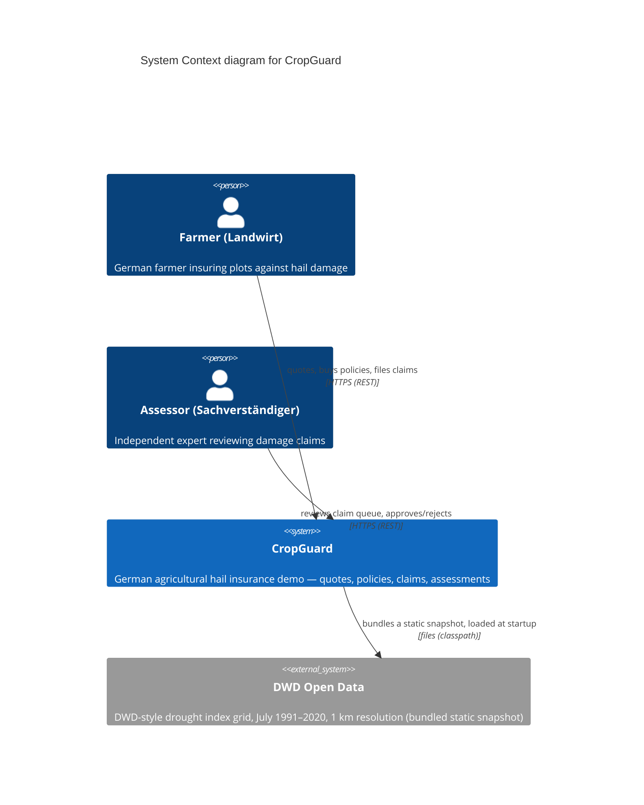

# 03 — Context and Scope

## Business Context

Two human roles interact with the system:

- **Farmer (Landwirt)** — registers, quotes, buys hail policies, files damage claims and
  tracks their status.
- **Assessor (Sachverständiger)** — reviews the claim queue, determines damage percentage,
  decides APPROVED/REJECTED, and thereby triggers the payout amount.

The system is self-contained: CropGuard owns the whole insured-ecosystem model
(insured → plots → policies → claims → hail events).

## C4 Level 1 — System Context

## Technical Context

The CropGuard system is deployed as two cooperating processes on a single developer machine:

1. **Angular SPA** (dev server, port 4200) — browser UI for both roles, proxying `/api`
   and `/actuator` to the backend (no CORS configuration required).
2. **Spring Boot REST API** (port 8080) — all business logic, JWT authentication, JPA
   persistence into an in-memory H2 database.

REST is the only machine-to-machine interface (plus Actuator endpoints for health/metrics).
The Angular dev server proxy means browsers never talk to the backend directly during
development.

Questions answered by the context diagram:

- **Who is outside the system?** Farmer, Assessor, and (at load time) the DWD dataset.
- **What does the system not do?** It does not invoice, does not geo-code, and does not
  contact the DWD at runtime.
- **Interfaces**: REST/JSON over HTTP; the frontend consumes it via an Angular dev-server
  proxy; the DWD grid is read once from the classpath on startup.

## Scope

The documentation scope is the whole repository (`cropguard` Spring Boot backend +
`frontend/` Angular SPA). Out of scope: external email, printed policies, regulatory
(marketing) compliance.
