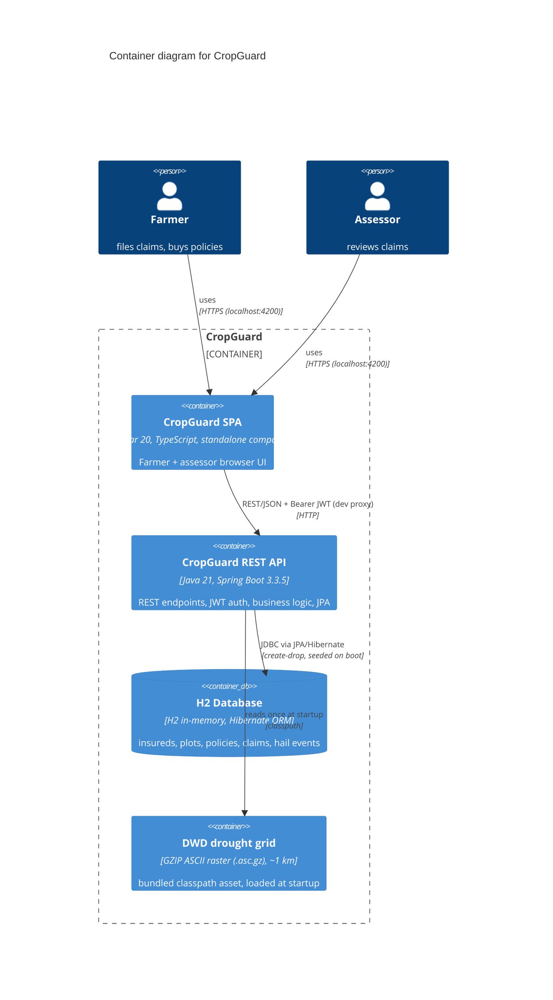
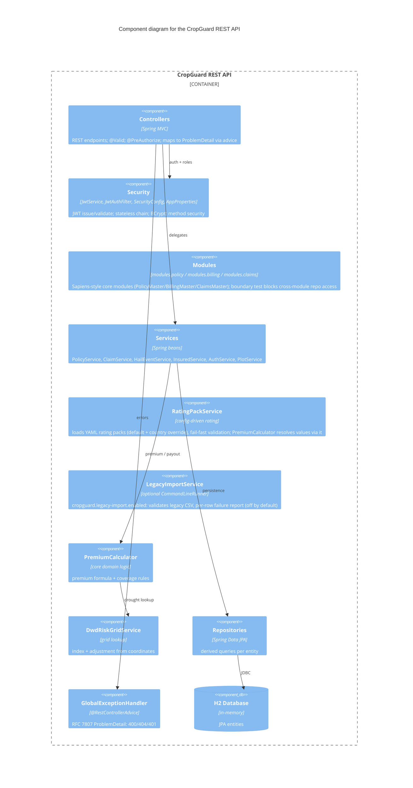

# 05 — Building Block View

## C4 Level 2 — Container Diagram



**Container responsibilities**

| Container | Technology | Responsibility |
|-----------|------------|----------------|
| CropGuard SPA | Angular 20 (standalone) | Two persona portals (`/farmer` Übersicht/Anbau/Verträge/Schäden/Lage, `/assessor` Aufgaben/Lagebild) with top-bar section nav; quote calculator, guided FNOL wizard, plot→policy→claim forms, claim workbench. Token-based design system (`styles.css`), skeletons/empty states, AA contrast, usable at 360 px. JWT held in `localStorage`; `proxy.conf.json` forwards `/api` + `/actuator` to the backend. |
| CropGuard REST API | Java 21, Spring Boot 3.3.5 | All business rules (premium calc, claim status machine, coverage validation), JWT auth, persistence, error mapping, actuator endpoints. |
| H2 Database | H2 in-memory (`create-drop`) | Persistence of the insurance model. Re-seeded by `DataInitializer` on every boot. |
| DWD drought grid | ASCII raster (`.asc.gz`) | 1991–2020 July drought index at 1 km; looked up by GK3 coordinate → premium factor 0.95–1.4 (formula `1 + (index−2)×0.05`, clamped [0.8, 1.5]). Static, so quotes are reproducible. |

## C4 Level 3 — Component Diagram (backend whitebox)



**Component responsibilities**

| Component | Key classes | Responsibility |
|-----------|-------------|----------------|
| Controllers | `InsuredController`, `AuthController`, `PlotController`, `PolicyController`, `ClaimController`, `HailEventController`, `RiskMapController` | REST surface; Bean Validation (`@Valid`); role enforcement (`@PreAuthorize("hasRole('ASSESSOR')")` on assess). `RiskMapController` serves the downsampled DWD grid for the frontend heat map. |
| Security | `JwtService`, `JwtAuthFilter`, `SecurityConfig`, `AppProperties` | Issue/validate HS512 JWTs; extract Bearer token into `SecurityContext`; stateless filter chain; BCrypt encoder; permit `/api/auth/**` + `/api/insureds/**`. |
| Services | `InsuredService`, `AuthService`, `PlotService`, `PolicyService`, `ClaimService`, `HailEventService` | Business workflow: coverage checks, status machine, hail-event linking, payout orchestration. |
| PremiumCalculator | `PremiumCalculator` (record `PremiumResult`) | Core formula + business rules (min premium €50, max coverage €500k, coverage ≥ 10× premium). |
| DwdRiskGridService | `DwdRiskGridService` | Parses the 1 km grid at startup (`@PostConstruct`); `getDroughtIndex(e,n)` / `getDroughtAdjustment(e,n)`. |
| Repositories | `InsuredRepository`, `PlotRepository`, `PolicyRepository`, `ClaimRepository`, `HailEventRepository` | Spring Data derived queries (e.g. `findByPolicyPlotInsuredId`). |
| Error advice | `GlobalExceptionHandler` + `ResourceNotFoundException`, `BusinessException`, `UnauthorizedException` | Maps domain failures to RFC 7807 `ProblemDetail` (404 / 400 / 401). |

## C4 Level 3 — Frontend components (Angular)

The SPA is split into two role portals; each portal section is a standalone routed component
under `/farmer/*` resp. `/assessor/*` (guarded by role, deep-linkable, top-bar section nav).

```mermaid
C4Component
  title Component diagram for the CropGuard Angular SPA

  Container_Boundary(spa, "CropGuard SPA") {
    Component(shell, "App", "root component", "top bar, portal nav, role badge, router outlet")
    Component(authSvc, "AuthService", "service (signals)", "login/register/logout; session in localStorage")
    Component(int, "authInterceptor", "HTTP interceptor", "attaches Bearer token; handles 401")
    Component(guard, "AuthGuard", "route guard", "FARMER vs ASSESSOR role gating")
    Component(login, "Login / Register / Forbidden", "pages", "credential forms, role-denied page")

    Component_Boundary(farmerPortal, "Farmer portal (/farmer)") {
      Component(fUebersicht, "Übersicht", "page", "KPI cards, policy table, claims timeline, live quote calculator")
      Component(fAnbau, "Anbau", "page", "managed plot table + side-panel create form")
      Component(fVertraege, "Verträge", "page", "policy purchase form + policy list")
      Component(fSchaeden, "Schäden + ClaimWizard", "page + wizard", "guided 4-step FNOL journey; claim history table")
      Component(fLage, "Lage", "page", "DWD risk map with own plot markers")
    }
    Component_Boundary(assessorPortal, "Assessor portal (/assessor)") {
      Component(aAufgaben, "Aufgaben", "page", "workbench: KPI row, filterable/sortable claim queue, assess panel")
      Component(aLagebild, "Lagebild", "page", "hail-event feed + portfolio risk map")
    }

    Component(ui, "shared/ui", "primitives", "Badge, KpiCard, Skeleton, EmptyState")
    Component(riskmap, "RiskMap", "canvas component", "DWD drought-grid heat map + plot markers")
    Component(tokens, "styles.css", "design tokens", "single-source palette/spacing/typography for every page")
    Component(ms, "models.ts", "TS interfaces", "DTO mirrors")
  }

  Rel(login, authSvc, "calls")
  Rel(fUebersicht, authSvc, "user/role")
  Rel(guard, authSvc, "role check")
  Rel(int, authSvc, "token source")
  Rel(fUebersicht, int, "requests")
  Rel(aAufgaben, int, "requests")
  UpdateLayoutConfig($c4ShapeInRow="3", $c4BoundaryInRow="2")
```

**Portal sections** (aligned with the tile-based member portals of leading agricultural
insurers: brand-green design system, Kachel tile navigation, established portal wording — see README)

| Portal | Section (route) | Content |
|--------|-----------------|---------|
| Farmer | Übersicht `/farmer/uebersicht` | Tile grid (Anbau / Meine Verträge / Schaden / Wetter & Lage with live counts), KPI cards, own policies table, recent-claims timeline, live premium quote calculator |
| Farmer | Anbau `/farmer/anbau` | Managed plot table + side-panel plot creation (GK3 coordinates) — managed-register pattern |
| Farmer | Meine Verträge `/farmer/vertraege` | Policy purchase form + own policy list with status badges |
| Farmer | Schaden `/farmer/schaeden` | 4-step FNOL wizard (guided claim journey, 4-day reporting hint) + claim history with hail-event linkage |
| Farmer | Wetter & Lage `/farmer/lage` | DWD drought risk map with own plot markers |
| Assessor | Aufgaben `/assessor/aufgaben` | Workbench: KPI row (open items / open sum / paid sum), status-filter + sortable claim queue, assess panel with customer/policy context |
| Assessor | Lagebild `/assessor/lagebild` | Registered hail-event feed (severity badges) + portfolio-wide risk map |

All sections load through the same primitives: shimmer skeletons while data is in flight,
`EmptyState` placeholders for empty lists, token-based styling (`styles.css`), tables that
scroll horizontally on small screens (usable at 360 px), WCAG-AA contrast + `:focus-visible`
everywhere.
