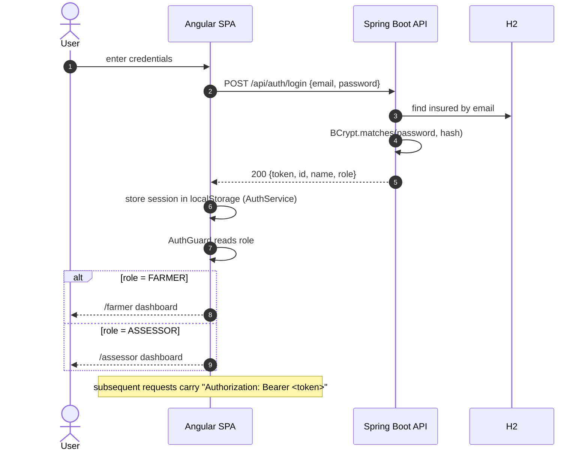
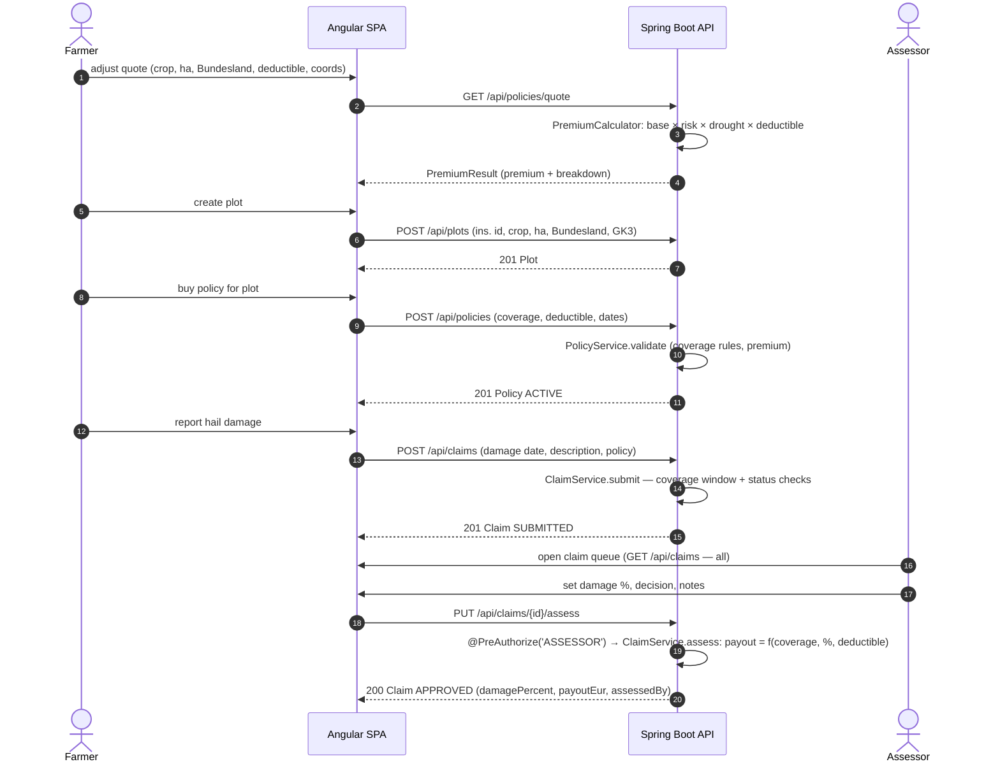
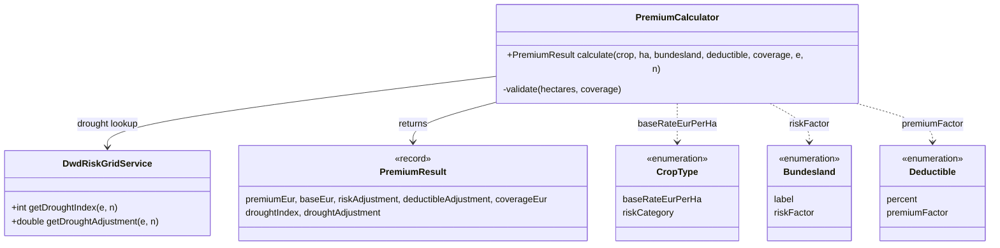

# 06 — Runtime View

The most important runtime scenarios, with sequence diagrams.

## Scenario 1 — Login and role-based entry

Wrong credentials → `UnauthorizedException` → 401 `ProblemDetail` → shown in an alert box;
wrong role on a guarded route → "Zugriff verweigert" (forbidden) page.

## Scenario 2 — The full claim lifecycle (the demo's core journey)

## C4 Level 4 — Code diagram (example: premium calculation)

Level 4 shows a representative slice of the code — the pricing core, since it is the most
domain-critical logic. (Full class-level documentation is unnecessary for any other path.)

Business rules enforced in `calculate` / `validate`:

1. `base = cropType.baseRateEurPerHa × hectares`
2. `premium = base × bundesland.riskFactor × droughtAdjustment × deductible.premiumFactor`
   (rounded to cents, `MIN_PREMIUM_EUR = 50`)
3. Coverage ≤ `MAX_COVERAGE_EUR = 500_000`
4. `coverage ≥ 10 × premium` (insurance principle)

`DwdRiskGridService` resolves a GK3 coordinate to the 1 km grid cell and returns index 0–10
(adjustment 0.8–1.5). With null coordinates the drought adjustment is skipped (1.0).
