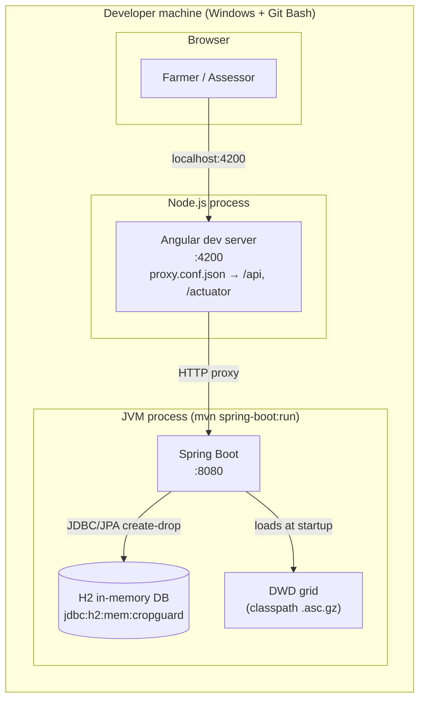

# 07 — Deployment View

## Infrastructure: development / demo deployment

The primary scenario is the developer machine: `mvn spring-boot:run` + `npm start`.
A container scenario (Docker Compose: backend JAR + nginx-served SPA) and a CI pipeline
(GitHub Actions: backend tests, frontend build/Karma, Playwright E2E on every push) exist
alongside it — see below.

## Infrastructure elements

| Element | Details |
|---------|---------|
| **Backend** | Spring Boot 3.3.5, embedded Tomcat on `:8080`. Run with `mvn spring-boot:run`; requires **JDK ≥ 21** (on this machine: `JAVA_HOME=C:\Program Files\Java\jdk-22`, Maven 3.9.9). The H2 console runs at `/h2-console` (JDBC `jdbc:h2:mem:cropguard`). |
| **Database** | In-memory H2, `ddl-auto: create-drop`, `open-in-view: false`, JDBC `jdbc:h2:mem:cropguard` (`DB_CLOSE_DELAY=-1`). `DataInitializer` (a `CommandLineRunner`) seeds 1 farmer, 1 assessor, 1 plot, 1 policy, 1 claim, 1 hail event on every boot. |
| **DWD grid** | Bundled at `src/main/resources/dwd/drought_index_july_1991_2020.asc.gz`; parsed by `@PostConstruct` into an in-memory grid (~memory-footprint of a 1 km raster for Germany). |
| **Frontend** | Angular dev server on `:4200` (`ng serve` / `npm start`). `proxy.conf.json` forwards `/api` and `/actuator` to `:8080`, so the browser never needs CORS. |
| **Static data** | Seeded demo users: `max@bauernhof.de/passwort123` (FARMER), `lisa@cropguard.de/assessor123` (ASSESSOR). |

## Deployment view of the packaged artifact

`mvn package` produces an executable Fat JAR (`spring-boot-maven-plugin`) that bundles the
backend *and* the DWD grid — it runs stand-alone with the frontend pointed at it. The Angular
SPA itself is not packaged into the JAR (it is consumed via the dev server during demos);
integrating the built SPA output into the JAR is a documented follow-up, not a current feature.

## Container deployment (Docker Compose)

`docker compose up --build` starts two containers:

| Container | Image | Content |
|-----------|-------|---------|
| `backend` | multi-stage `Dockerfile` (Maven + Temurin 21 → Temurin 21 JRE) | Spring Boot fat JAR on `:8080`, H2 in-memory |
| `frontend` | multi-stage `frontend/Dockerfile` (Node 22 build → `nginx:alpine`) | built SPA on `:80`; `nginx.conf` serves it and proxies `/api`, `/actuator`, `/v3/api-docs`, `/swagger-ui` to `backend:8080` |

Same trade-off as the dev setup: H2 is in-memory, so **data resets when the backend container
restarts** (`DataInitializer` reseeds). The compose stack is a demo deployment, not a
production target.

## Production deployment: cropguard.graphwiz.ai

Live at **https://cropguard.graphwiz.ai** (edge host `195.90.216.159`, traefik fronts
`*.graphwiz.ai` and terminates Let's Encrypt via the `mytlschallenge` resolver).

- Stack: `docker-compose.prod.yml` on the host (`~/cropguard`) — same two services as the
  local compose, but the backend has **no published port** (internal only, reached through
  the SPA's nginx proxy) and the frontend publishes `127.0.0.1:3011` only.
- Routing: traefik file-provider routers (`cropguard-http` → redirect, `cropguard-secure` with
  `security-headers` + `compression` + LE cert) point to `http://127.0.0.1:3011`; mirrored in
  the ansible repo (`inventory/host_vars/contextual-intelligence.org.yaml`).
- Images are **built locally** and transferred (`docker save | docker load`) — the shared edge
  host is memory-constrained for container builds (see its post-mortem notes), so no build
  runs there. Deploy: `docker compose -f docker-compose.prod.yml up -d` after loading images.
- Same demo caveat: H2 in-memory, data resets when the backend container restarts.

## CI (GitHub Actions)

`.github/workflows/ci.yml` runs on every push/PR, three jobs on `ubuntu-latest`:

1. **backend** — `mvn -B test` (Temurin 21, Maven cache)
2. **frontend** — `npm ci`, `ng build`, Karma with `ChromeHeadless`
3. **e2e** — `npx playwright install --with-deps chromium`, full Playwright suite
   (auto-starts both servers via the `webServer` config; Maven resolved cross-platform via
   `MVN_CMD`/platform default). Failures upload the HTML report as an artifact.

## Environment / Profiles

- `application.yml` — base config (H2, JWT dev secret, actuator exposure).
- `application-dev.yml` — activates with `--spring.profiles.active=dev`: SQL + Security
  DEBUG logging for teaching observability (course module 9).
