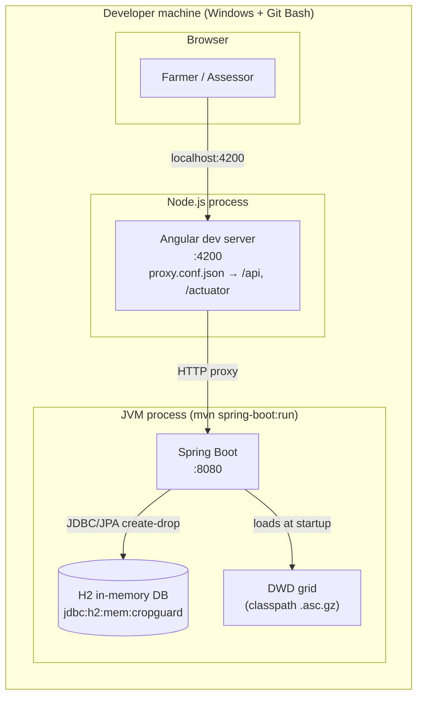

# 07 — Deployment View

## Infrastructure: development / demo deployment

There is exactly one deployment scenario: the developer machine. No CI, no server, no
container — the "production" of this project is `mvn spring-boot:run` + `npm start`.

## Infrastructure elements

| Element | Details |
|---------|---------|
| **Backend** | Spring Boot 3.3.5, embedded Tomcat on `:8080`. Run with `mvn spring-boot:run`; requires **JDK ≥ 21** (on this machine: `JAVA_HOME=C:\Program Files\Java\jdk-22`, Maven 3.9.9). The H2 console runs at `/h2-console` (JDBC `jdbc:h2:mem:cropguard`). |
| **Database** | In-memory H2, `ddl-auto: create-drop`, `open-in-view: false`, JDBC `jdbc:h2:mem:cropguard` (`DB_CLOSE_DELAY=-1`). `DataInitializer` (a `CommandLineRunner`) seeds 1 farmer, 1 assessor, 1 plot, 1 policy, 1 claim, 1 hail event on every boot. |
| **DWD grid** | Bundled at `src/main/resources/dwd/drought_index_july_1991_2020.asc.gz`; parsed by `@PostConstruct` into an in-memory grid (~memory-footprint of a 1 km raster for Germany). |
| **Frontend** | Angular dev server on `:4200` (`ng serve` / `npm start`). `proxy.conf.json` forwards `/api` and `/actuator` to `:8080`, so the browser never needs CORS. |
| **Static data** | Seeded demo users: `max@bauernhof.de/passwort123` (FARMER), `lisa@cropguard.de/assessor123` (ASSESSOR). |

## Deployment view of the packaged artifact

`mvn package` produces an executable Fat JAR (`spring-boot-maven-plugin`) that bundles the
backend *and* the DWD grid — it runs stand-alone with the frontend pointed at it. The Angular
SPA itself is not packaged into the JAR (it is consumed via the dev server during demos);
integrating the built SPA output into the JAR is a documented follow-up, not a current feature.

## Environment / Profiles

- `application.yml` — base config (H2, JWT dev secret, actuator exposure).
- `application-dev.yml` — activates with `--spring.profiles.active=dev`: SQL + Security
  DEBUG logging for teaching observability (course module 9).
